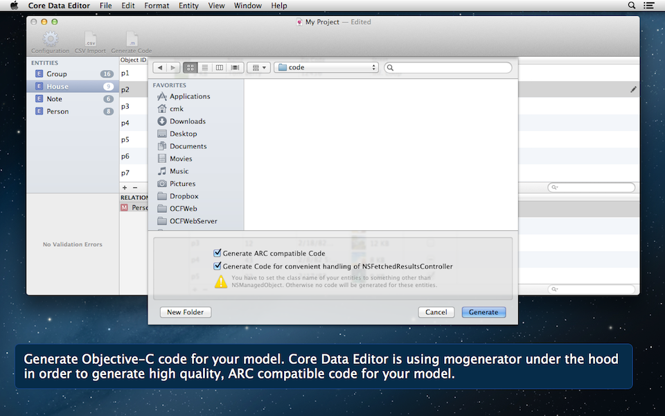

# Build Status
| Branch        | Status           | 
| ------------- |:-------------:|
| Master      |  |
| Develop      |       |

# Core Data Editor

Core Data Editor lets you easily view, edit and analyze applications‘ data. Core Data Editor is compatible with Mac and iOS applications and supports XML, SQLite and binary stores, visualizes all relationships and is able to edit the data and generate Objective-C code for the data model.

Core Data Editor will guide you through a short setup process when you initially launch the app. This setup process is entirely optional. You can skip over each and every step if you know what you are doing. It is recommended that you take your time and go though the setup process. It only takes a few minutes. 

# Donations
If you want to support Core Data Editor you can [donate via PayPal](https://www.paypal.me/christiankienle).

Thanks.

# Building Core Data Editor
Download the sources, open the workspace in Xcode and hit build and run. Done.

# Architecture
Core Data Editor is all about displaying and editing managed objects. A large chunk of code simply deals with that aspect.

## CDEManagedObjectsViewController
This class is very important because it is responsible for a lot of different things:

* Display 0-n managed objects in a table view.
* Manage a search field that allows the user to filter the currently displayed managed objects.
* Allow the user to add and/or remove managed objects.

A managed objects view controller can display all objects from a specific entity or all objects that are related to an object with regards to a specific relationship (which can be a to-one, to-many (ordered or unordered)).  

So, you can throw almost any request at a managed objects view controller and it will just work. It works even though displaying ALL objects that belong to a specific entity works differently than just displaying an object that is part of a to-one relationship. This is where data coordinators come into play. A data coordinator abstracts all the differences away and every managed objects view controller is powered by a data coordinator.

## Data Coordinators
As already mentioned each managed objects view controller is powered by a data coordinator. A data coordinator can

* load the requested objects
* prepare a table view (= create the table columns needed to display the managed objects)
* create object values for the rows/columns of the table view
* create new managed objects
* delete (selected) managed objects
* allow the user to edit values
* auto save entity related information (column width, column ordering)

A data coordinator is represented by an instance of  `CDERequestDataCoordinator`. This class has a lot of methods for the abilities described above. Most of the methods have a default implementation. This class is supposed to be subclassed. There are several subclasses:

* `CDEEntityRequestDataCoordinator`: If a managed objects view controller wants to display ALL objects that belong to a specific entity it simply creates an `CDEEntityRequestDataCoordinator`. Internally a `CDEEntityRequestDataCoordinator` sets up an `NSArrayController` to do the heavy lifing. It also allows the creation and deletion of objects.
* `CDEUnorderedRelationshipRequestDataCoordinator`: This class is used by a managed objects view controller that wants to display an unordered to-many relationship. If a user wants to add an object this coordinator creates an object and establishes a relationship to the original object.
* `CDEOrderedRelationshipRequestDataCoordinator`: This coordinator works similar to the unordered version but in addition it creates an additional table column which contains the order index of the displayed managed objects.
* `CDEToOneRelationshipRequestDataCoordinator`: A to-one coordinator is responsible for managing everything that has to do with an object that is part of a to-one relationship. It's main purpose is to introduce a different add/remove behavior: Adding a managed object to a to-one relationship does only make sense if there is not already a related object present.  

That being said there should be little reason to introduce a new coordinator subclass. 

# Contributing
If you want to contribute send me pull requests. Have a look at the issue tracker to find out what should be done next. 

# Credits
Core Data Editor has the following third party dependencies:

* BFNavigationController
* CHCSV Parser
* Omni NSAlert Extensions
* RSVerticallyCenteredTextFieldCell
* Code from ATS
* mogenerator

# Contributors
* [Christian Kienle](https://github.com/ChristianKienle) (original developer, maintainer)
* [Denis Lebedev](https://github.com/garnett) 
* [danydev](https://github.com/danydev)
* [Roberto Dries](https://github.com/robertodries92)
* [Mitch Cohen](https://github.com/mitchcohen)
# Contact
[Christian Kienle (kienle.christian@icloud.com)](mailto:kienle.christian@icloud.com) 

# License
3-clause BSD (please don't sue me)
